# Kubernetes from scratch

A plain-English walkthrough of Kubernetes with no assumed background, built around
the FastAPI app in this repository. Ten steps, one idea each.

If you already know the concepts and want the reference version — real command
output, failure catalogue, findings carried forward to later stages — read
[01-kubernetes-fundamentals.md](01-kubernetes-fundamentals.md) instead.

---

## Step 1 — Why Kubernetes exists at all

You have an app. You want it to **always be running**. That is the entire problem.

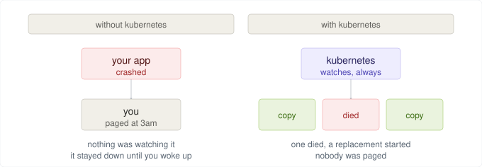

Run your app on one machine and it crashes at 3am, nothing notices. It stays dead
until a person restarts it by hand.

Run several copies with something watching them, and a replacement starts on its
own. Kubernetes is that watcher.

**The idea that makes everything else make sense:** you never tell Kubernetes
*"start my app"*. You tell it *"I want 3 copies running at all times"* — and it keeps
checking, forever. Two copies? It starts one. Four? It kills one.

That is different from every normal command. `python app.py` runs once and stops
mattering. Kubernetes takes an instruction and **keeps enforcing it**.

---

## Step 2 — What "a copy of your app" is

Kubernetes calls it a **pod**.

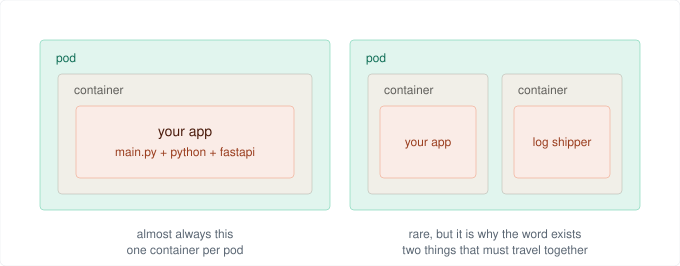

A **container** is a sealed lunchbox: your code plus everything it needs to run —
Python itself, the libraries, all of it. That is why it behaves the same on your
laptop and in Azure. `app/Dockerfile` builds one.

A **pod** is the tray the lunchbox sits on. Kubernetes only ever picks up trays,
never lunchboxes directly.

**Why the tray?** Occasionally two containers must stay together on the same
machine — your app and a helper that ships its logs. One tray, two boxes. So
Kubernetes always moves trays, even when there is only one box on it.

In practice: **1 pod = 1 container = 1 copy of your app.**

---

## Step 3 — Who does the watching

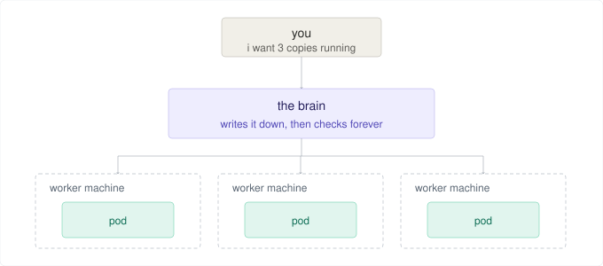

A **cluster** is a group of machines pretending to be one machine. They split into
two jobs:

| | Job |
| --- | --- |
| **Worker machines** (called **nodes**) | Actually run your pods |
| **The brain** (called the **control plane**) | Decides which worker gets which pod, then watches forever. Does not run your app. |

**You only ever talk to the brain.** You never log into a worker machine and start
something by hand.

So when a pod dies: the brain notices, checks its notes, sees it wanted 3 and can
only count 2, and tells a worker to start another. Nobody gets paged.

---

## Step 4 — How you ask for copies

You write the brain a note. The note is called a **Deployment**.

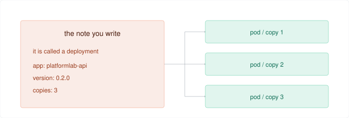

You never create copy 1, copy 2, copy 3. You write down *"I want 3"* and hand it
over. The note lives in this repo as `k8s/20-deployment.yaml`, and only two lines
really matter:

```yaml
replicas: 3                     # how many copies
image: platformlab-api:0.2.0    # which version
```

**You change the note, never the pods:**

| Edit the note to say | Kubernetes does |
| --- | --- |
| `replicas: 5` | starts 2 more |
| `replicas: 1` | kills 2 |
| `image: ...0.3.0` | swaps all 3 for the new version, carefully, one at a time |

This is what "declarative" means — describe the destination, not the turns.

---

## Step 5 — How anything finds your pods

Every time a pod is replaced, **the new one has a different address**. So nothing can
ever be given a pod's address directly.

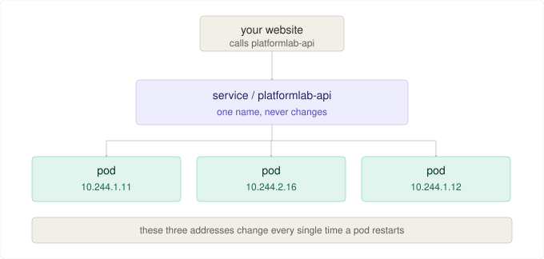

A **Service** is a permanent name in front of temporary things. Like a shop's phone
number: the staff change every day, the number on the door does not.

**How does it know which pods are its own?** Not by name — by **sticker**. Every pod
the Deployment creates wears a label like `app: platformlab-api`, and the Service's
whole instruction is *"send calls to anything wearing that sticker"*. That is why
pods created five minutes from now join automatically, with no list to update.

You also get load balancing free: three pods wear the sticker, so calls spread
across all three.

**Two ports, which confuses everyone once:**

```yaml
port: 80          # what the Service answers on -- what callers dial
targetPort: 8000  # what your container listens on
```

---

## Step 6 — How Kubernetes knows a copy actually works

A pod can be switched on but useless: still loading, lost its database connection,
or overwhelmed. Nothing crashed — but sending customers there would be a bad idea.

So Kubernetes asks each copy a question every few seconds.

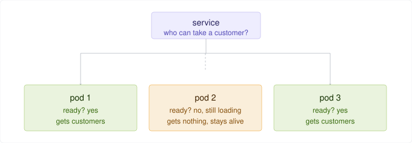

The question is a real HTTP call — `GET /ready`. Answer OK and you stay on the list.
Answer anything else and you come **off** the list. Not killed. Just skipped. The
moment you answer OK again, you rejoin automatically.

A Service sends work to a pod only if **both** are true: it wears the sticker **and**
it said yes.

### There are two questions, not one

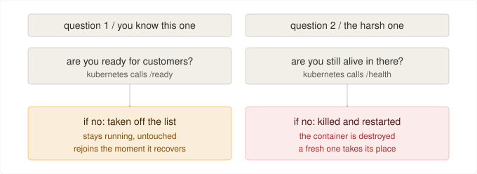

| Name | The question | If the answer is no |
| --- | --- | --- |
| **readiness probe** | should I send you customers? | off the list, stays alive |
| **liveness probe** | are you still alive in there? | **killed and restarted** |

Liveness exists because a program can be **frozen** rather than crashed — deadlocked,
stuck in a loop. The OS thinks it is fine. Only a restart fixes it.

### The one rule that matters

> **A liveness check must only ever check itself. Never a database, never another
> service.**

Write liveness as *"can I reach the database?"* and one 20-second database hiccup
makes all three pods fail at the same moment, so Kubernetes kills all three at once.
A brief wobble becomes a full outage that you caused.

Put the identical check in **readiness** and all three quietly leave the list, keep
running, and rejoin 20 seconds later. Users saw a slow patch instead of an outage.

Same check, one line different.

> **readiness** decides *do you get work?* — **liveness** decides *do you get to live?*

---

## Step 7 — Giving a pod settings without rebuilding it

Settings have to differ between environments. If they were baked into the image you
would need a different image per environment, and the image you tested would never
be the image you shipped.

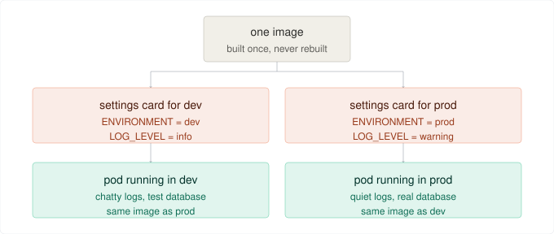

The settings card is a **ConfigMap** — a list of name/value pairs kept outside the
image and handed to the pod at startup. Same image both sides, different card,
different behaviour. Yours is `k8s/10-configmap.yaml`.

### Secrets — same idea, one big warning

Passwords belong in a **Secret**, a near-identical object. But Kubernetes Secrets are
**base64-encoded, not encrypted**. Base64 is not security, it is a different
alphabet. Anyone who can read Secrets in your namespace reads the plaintext.

Fine for a lab. Not fine for real credentials — which is why Azure Key Vault appears
later in the roadmap.

### Why changing a ConfigMap needs a restart

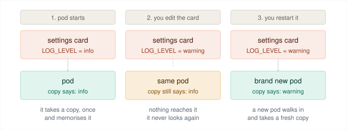

This is not a Kubernetes rule. It is how every program works. Settings are handed
over **as the process launches**; nothing outside can change them afterwards.

You have seen this on your own laptop:

```bash
export LOG_LEVEL=info
python app.py          # reads "info" and remembers it
```

Change `LOG_LEVEL` in another terminal and the running app does not care. It read the
value once, at the door.

The ConfigMap is the `export`. The pod is the running process. To hand over new
values you need a new pod:

```bash
kubectl rollout restart deployment/platformlab-api -n dev
```

| How settings are handed over | Changing the ConfigMap |
| --- | --- |
| **As variables** (what this repo does) | Pod never finds out. Restart required. |
| **As a mounted file** | File updates automatically — *but the app must re-read it* |

---

## Everything so far, in one picture

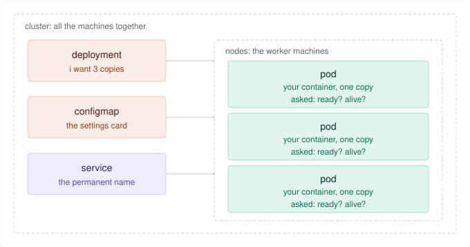

---

## Step 8 — What each pod costs you

When you write the note you also say how much each copy needs. Kubernetes uses that
number to decide how many copies fit on one machine — which decides how many machines
you rent.

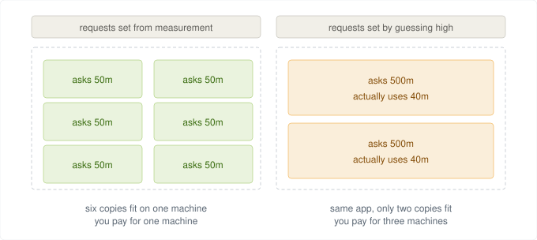

Same app on both sides. Same code, same traffic. The only difference is a number in a
YAML file, and the bill tripled.

**`request`** — *"reserve this much for me."* Reserved whether you use it or not.
Reserve 500m, use 40m, and the other 460m is spoken for but idle. You pay for empty
space. This is the number that costs money.

**`limit`** — *"never let me go above this."* A safety ceiling, not a cost control.

`m` means **millicores**: `1000m` is one whole CPU core, so `50m` is 5% of a core.

```yaml
requests:  {cpu: "50m",  memory: "64Mi"}    # reserved for me
limits:    {cpu: "500m", memory: "256Mi"}   # never go above
```

**Hitting the two limits is not the same thing:**

| | Over the CPU limit | Over the memory limit |
| --- | --- | --- |
| What happens | **Slowed down** (throttled) | **Killed instantly** (OOMKilled) |
| Survives | Yes | No |
| How you notice | Things get sluggish | Restart count climbing |

You can always give a program less CPU — it just runs slower. You cannot give it less
memory; the bytes either exist or they do not. There is no "slower memory", so the
kernel's only option is to kill it.

> **CPU limits make you slow. Memory limits make you dead.**
> Set requests from measurement, not optimism.

---

## Step 9 — Where to look when something breaks

Two places, and picking the wrong one wastes hours.

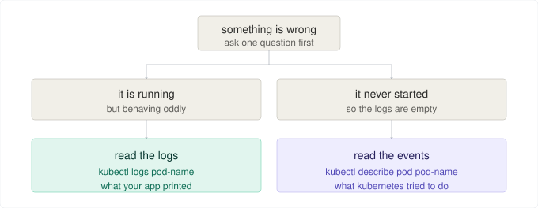

**Logs** are what *your app* said. **Events** are what *Kubernetes tried to do*. If a
pod never started, your app never ran, so the logs are empty and the answer is always
in events.

### The status word names the failure before you read anything

| What you see | What it means |
| --- | --- |
| **Pending** | Nowhere to put it. Usually step 8 — asked for more than any machine has. |
| **ImagePullBackOff** | Could not download the image. Wrong tag, or no permission. |
| **CrashLoopBackOff** | Starts, dies, repeats. The app is erroring on startup. |
| **OOMKilled** | Ran out of memory. Step 8 again. |
| **Running, 0/1 ready** | Alive, but said *not ready*. Step 6. Nothing reaches it. |

That last row is the sneaky one — everything looks healthy and no traffic arrives.

### The trick worth knowing

When a pod keeps crashing, `kubectl logs` shows the **current** container, which has
just started and done nothing. The error was in the one that died:

```bash
kubectl logs pod-name --previous
```

---

## Step 10 — Shipping a new version without downtime

The naive way is: stop the old thing, start the new thing. That is an outage every
release, and an unending one if the new thing is broken.

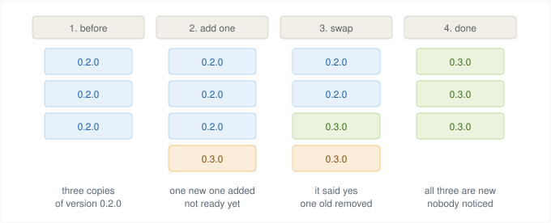

**Count the boxes in panel 2 — there are four.** It **adds before it removes**, so
capacity never dips below three.

And each step is gated on the new copy saying **ready**. That is step 6 doing real
work: Kubernetes removes an old copy only after a new one has proved it can serve.

You trigger all of it by changing one line in the note:

```yaml
image: platformlab-api:0.3.0
```

### If the new version is broken

Nothing happens. No old copy is removed, no further new copies start, and the
rollout simply stops with the old copies still serving everything. The broken version
sits there receiving zero traffic.

**A stuck rollout is not a failure. It is the seatbelt working.**

### Rolling back

Kubernetes keeps the old recipe, so going back is near-instant — nothing is rebuilt
or re-downloaded:

```bash
kubectl rollout undo deployment/platformlab-api -n dev
```

> **One caveat:** `rollout undo` changes the cluster but not your YAML files, so the
> repo and the cluster now disagree. The next `kubectl apply -f k8s/` silently undoes
> the rollback. This is one of the concrete problems Helm solves.

---

## Bonus — who owns what in AKS

A common interview question is *"with AKS, what is yours and what is Azure's?"* It is
testing one thing: **where the line between the brain and the workers falls.**

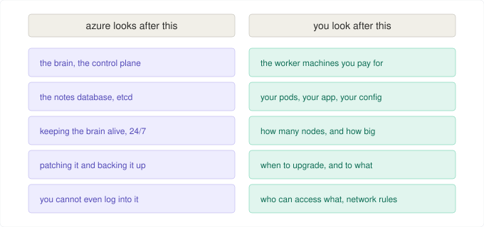

The phrase is the **shared responsibility model**.

Azure runs the control plane — you cannot SSH into it, you do not patch it, you do
not back it up, and on the Free tier you do not pay for it. Everything below that
line is yours: node count and size, what runs on them, when to take an upgrade, RBAC,
secrets, and the network rules around your subnets.

**So "managed" means managed control plane. It does not mean managed security, and it
does not mean managed cost.**

**On the bill:** you pay for worker nodes, billed like ordinary VMs. *"How much does
my cluster cost?"* almost always means *"how many nodes, and how big?"* — your side of
the line.

**The nuance, if pushed:** node patching is genuinely shared. Azure publishes patched
node images; **you** decide when to apply them, and a reboot still needs you to
trigger it.

---

## Every word, in one table

| Word | Plain English |
| --- | --- |
| **cluster** | all the machines, working as one |
| **node** | one worker machine |
| **control plane** | the brain — decides and watches, does not run your app |
| **container** | your app sealed in a box with everything it needs |
| **pod** | one copy of your app (the tray the container sits on) |
| **deployment** | the note saying *"I want 3 copies of this version"* |
| **service** | the permanent name in front of changing pods |
| **readiness probe** | *do you get work?* — off the list if no |
| **liveness probe** | *do you get to live?* — restarted if no |
| **configmap** | the settings card |
| **secret** | the settings card for passwords (base64, **not** encrypted) |
| **request** | capacity reserved for a pod — the number that costs money |
| **limit** | the ceiling a pod may not exceed |

---

## Next

Run it yourself with [k8s/README.md](../k8s/README.md), or read the reference version
with real output and failure modes in
[01-kubernetes-fundamentals.md](01-kubernetes-fundamentals.md).
