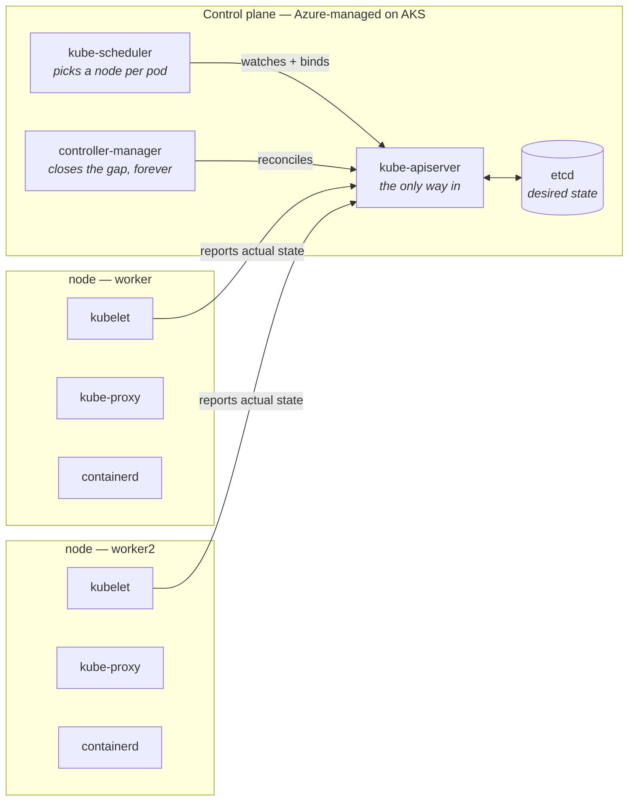
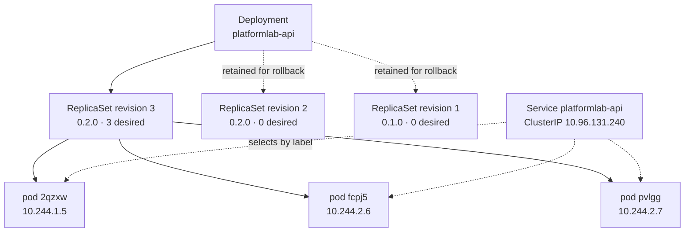

# Stage 1 — Kubernetes fundamentals

Worked through locally on a three-node [`kind`](https://kind.sigs.k8s.io/) cluster.
Nothing here needs Azure, and a kind cluster is architecturally identical to AKS —
same API server, same reconciliation loop, same failure modes.

**Cluster used throughout:** `kind-platformlab`, Kubernetes v1.36.1, one control-plane
node and two workers.

---

## Contents

| # | Concept | Section |
| --- | --- | --- |
| 01 | Cluster, control plane, worker node | [link](#01--cluster-control-plane-and-worker-node) |
| 02 | Pod | [link](#02--pod) |
| 03 | Deployment and ReplicaSet | [link](#03--deployment-and-replicaset) |
| 04 | Service | [link](#04--service) |
| 05 | Namespace | [link](#05--namespace) |
| 06 | ConfigMap and Secret | [link](#06--configmap-and-secret) |
| 07 | Liveness and readiness probes | [link](#07--liveness-and-readiness-probes) |
| 08 | Requests and limits | [link](#08--requests-and-limits) |
| 09 | Logs, events and debugging | [link](#09--logs-events-and-debugging) |
| 10 | Rolling updates and rollback | [link](#10--rolling-updates-and-rollback) |

---

## 01 — Cluster, control plane and worker node

A cluster is two populations of machines with different jobs. The **control plane**
decides what should be true. The **worker nodes** make it true.



The mechanism to internalise is the **control loop**. You never tell Kubernetes to
*do* something; you declare what should be true and a controller watches the
difference forever. Same idea as `terraform apply`, except continuous rather than
invoked.

### Observed

```
$ kubectl get pods -n kube-system
etcd-platformlab-control-plane                      platformlab-control-plane   Running
kube-apiserver-platformlab-control-plane            platformlab-control-plane   Running
kube-controller-manager-platformlab-control-plane   platformlab-control-plane   Running
kube-scheduler-platformlab-control-plane            platformlab-control-plane   Running
kube-proxy-4tbsl                                    platformlab-worker2         Running
kube-proxy-c78ks                                    platformlab-control-plane   Running
kube-proxy-xkgg6                                    platformlab-worker          Running
```

The four control-plane components run only on the control-plane node. `kube-proxy`
and the CNI run on *every* node — that is the DaemonSet pattern. On AKS the
control-plane pods are invisible; Microsoft runs them.

---

## 02 — Pod

One or more containers sharing a network namespace and volumes. Containers in a pod
reach each other on `localhost` and the pod holds a single IP. It is the smallest
schedulable unit — you cannot schedule a container.

Pods are **disposable by design**, and nothing recreates a hand-written pod when it
dies.

### Observed

A bare pod was created, served traffic, and deleted:

```
$ kubectl get pod platformlab-api -o wide
NAME              READY   STATUS    IP           NODE
platformlab-api   1/1     Running   10.244.2.2   platformlab-worker2

$ curl http://127.0.0.1:18000/health
{"status":"healthy"}

$ kubectl delete pod platformlab-api
pod "platformlab-api" deleted

$ kubectl get pods
No resources found in default namespace.
```

Nothing came back. No controller was watching it.

> **Note on pod IPs.** `10.244.2.2` comes from the CNI's pod CIDR, not from a node
> subnet. The same is true of AKS in **Azure CNI Overlay** mode — which means the
> `VirtualNetwork` NSG service tag does *not* match pod IPs there. In classic Azure
> CNI, pods draw from the subnet and it does. Choose deliberately at stage 4.

**Rule:** write a bare Pod manifest once to prove the image runs, then never again.

---

## 03 — Deployment and ReplicaSet

A **ReplicaSet** keeps exactly *N* pods matching a template running. A **Deployment**
owns ReplicaSets and uses them to change versions safely.



Each distinct pod template gets its own ReplicaSet. Old ReplicaSets stay at zero
replicas — **that is the rollback target**.

The Service points at *pods*, selected by label. It has no reference to the
Deployment or the ReplicaSet at all.

### Observed

Deleting a managed pod, in contrast to the bare pod above:

```
$ kubectl delete pod platformlab-api-6ffc4b4dd7-2tnqx -n dev
$ kubectl get pods -n dev
platformlab-api-6ffc4b4dd7-445z2   1/1   Running   25s
platformlab-api-6ffc4b4dd7-4xqzg   1/1   Running    7s   <-- replacement
platformlab-api-6ffc4b4dd7-cwm4j   1/1   Running   25s

$ kubectl get events -n dev --sort-by=.lastTimestamp
SuccessfulCreate    platformlab-api-6ffc4b4dd7         Created pod: platformlab-api-6ffc4b4dd7-4xqzg
Killing             platformlab-api-6ffc4b4dd7-2tnqx   Stopping container api
```

`SuccessfulCreate` was emitted by the **ReplicaSet**, not the Deployment — and the
replacement was created before the old container finished stopping.

Pod names encode the ownership chain: `platformlab-api` + `6ffc4b4dd7` (ReplicaSet
hash) + `4xqzg` (pod suffix).

> **Gotcha:** `spec.selector` is immutable after creation. Wrong labels means deleting
> and recreating the Deployment.

---

## 04 — Service

Pod IPs change constantly, so nothing should address one. A Service is a stable
virtual IP and DNS name in front of whichever pods currently carry a matching label —
a load balancer defined by a query, not a member list.

| Type | Behaviour |
| --- | --- |
| `ClusterIP` | Default. In-cluster only. What almost everything should be. |
| `NodePort` | Opens a high port on every node. Mostly a building block. |
| `LoadBalancer` | On AKS, provisions a real Azure Load Balancer and public IP. Costs money. |

Two ports, which is the pair that confuses everyone once:

```yaml
ports:
  - port: 80          # the Service listens here
    targetPort: http  # the container's named port (8000)
```

### Observed

Ten requests from inside the cluster to the short DNS name:

```
$ python -c "... urllib.request.urlopen('http://platformlab-api/info') x10"
platformlab-api-6ffc4b4dd7-445z2     3 requests
platformlab-api-6ffc4b4dd7-4xqzg     2 requests
platformlab-api-6ffc4b4dd7-cwm4j     5 requests

$ socket.gethostbyname('platformlab-api.dev.svc.cluster.local')
10.96.131.240
```

Distribution is random, not round-robin — `kube-proxy` picks an endpoint per
connection.

**A Service only routes to pods that are `Ready`.** A broken readiness probe therefore
presents as a networking failure. See concept 07.

---

## 05 — Namespace

A namespace scopes names and gives RBAC rules, resource quotas and NetworkPolicies
something to attach to. DNS disambiguates by namespace:
`platformlab-api.dev.svc.cluster.local`.

What a namespace is **not** is a security boundary. By default every pod can reach
every other pod across namespaces. Isolation comes from NetworkPolicy and RBAC — both
at stage 6. The namespace is just where you hang them.

```bash
kubectl create namespace dev
kubectl config set-context --current --namespace=dev
```

---

## 06 — ConfigMap and Secret

Both hold key–value data outside the image, so one image runs everywhere. ConfigMap
for non-confidential settings, Secret for the rest.

Be clear-eyed: **Secret values are base64-encoded, not encrypted.** Anyone who can
read Secrets in a namespace reads the plaintext. What protects them is RBAC plus
encryption at rest in etcd, which AKS provides. Enough for a lab; not enough for real
credentials — hence Key Vault and the CSI driver at stage 6.

| Injection method | Behaviour |
| --- | --- |
| Environment variables | Fixed at process start. Changing the ConfigMap does **not** update a running pod. |
| Mounted volume | Files refreshed by the kubelet within a minute or two, if the app re-reads them. |

### Observed

```
$ curl http://platformlab-api/info
{"environment":"dev","log_level":"info","release":"0.2.0","pod":"platformlab-api-74d6f9447f-fcpj5"}
```

`environment` and `log_level` come from the ConfigMap; `pod` comes from the downward
API (`fieldRef` on `metadata.name`), which is how a pod learns its own identity.

> **Never commit a real Secret manifest.** `.gitignore` already covers `*.tfvars` and
> `.env` for the same reason.

---

## 07 — Liveness and readiness probes

Two probes, two completely different consequences. Confusing them causes outages.

| Probe | Endpoint | On failure |
| --- | --- | --- |
| Liveness | `/health` | Container is **killed and restarted**. |
| Readiness | `/ready` | Pod is **removed from Service endpoints**, but keeps running. |

Liveness answers "is this process wedged?" — answer from process-local state only.
Readiness answers "should traffic arrive right now?" — dependency checks belong here.

**The classic self-inflicted outage:** a liveness probe that checks the database. The
database blips, every replica fails liveness simultaneously, Kubernetes restarts all
of them at once, and a brief dependency wobble becomes a total outage. A readiness
probe in that position would have parked traffic until the database returned.

There is also a `startupProbe`, which suspends the other two until the app has booted
once. Reach for it instead of inflating `initialDelaySeconds`.

---

## 08 — Requests and limits

**Requests** are what the scheduler reserves — the number that decides which node a
pod lands on, and whether it lands at all. **Limits** are the runtime ceiling. The
scheduler reads requests only; it does not care about limits.

| Resource | Over limit |
| --- | --- |
| CPU | Compressible → **throttled**. Gets slow, survives. Shows up as latency. |
| Memory | Incompressible → **OOMKilled** immediately, no grace period. Shows up as restarts. |

> **Cost:** requests, not usage, determine how many pods fit per node and therefore
> how many nodes AKS bills for. Requests set above real usage are the most common way
> a small cluster gets expensive.

---

## 09 — Logs, events and debugging

Two streams. **Logs** are what your process wrote to stdout. **Events** are what the
cluster tried to do to your pod. When a pod never starts, logs are empty and the
answer is always in events.

```bash
kubectl get pods -w                    # watch state change live
kubectl describe pod <name>            # events, at the bottom
kubectl logs <name>
kubectl logs <name> --previous         # the crashed run, not the current one
```

### Failure catalogue — all reproduced on this cluster

| Status | Cause | Where the evidence is |
| --- | --- | --- |
| `ImagePullBackOff` | Tag does not exist, or no credentials | `describe` → events |
| `CrashLoopBackOff` | Container starts and exits repeatedly | `logs --previous` |
| `Pending` | No node satisfies the requests, or a taint | `describe` → `FailedScheduling` |
| `OOMKilled` | Memory limit exceeded | `lastState.terminated`, **not** logs |
| `Running`, `0/1 ready` | Readiness probe failing | `describe` → probe events |

#### ImagePullBackOff — read the message carefully

```
Failed to pull image "platformlab-api:9.9.9": ... pull access denied,
repository does not exist or may require authorization:
server message: insufficient_scope: authorization failed
```

The tag did not exist locally, so containerd fell back to Docker Hub and got an auth
error. **The message says authorization; the actual cause is a missing tag.** This is
exactly the failure mode to expect with ACR at stage 3, and it sends people hunting
for credential problems that are not there.

#### OOMKilled — not in the logs

```
$ kubectl logs break-oom
(empty)

$ kubectl get pod break-oom -o jsonpath='{.status.containerStatuses[*].lastState.terminated}'
exit code: 137      # 128 + SIGKILL
reason:    OOMKilled
restarts:  3
```

The kernel killed it; the process never got to complain.

#### Pending — never scheduled

```
Warning  FailedScheduling  0/3 nodes are available:
  1 node(s) had untolerated taint(s), 2 Insufficient cpu.
```

The control-plane node's `NoSchedule` taint, plus two workers that cannot satisfy a
64-core request. No container exists, so there is nothing to log.

> Events expire after roughly an hour and are namespaced. Anything older is gone —
> which is much of why Container Insights and Log Analytics arrive at stage 7.

---

## 10 — Rolling updates and rollback

Changing the image tag replaces pods gradually. Two settings govern how gradually:

| Setting | Meaning |
| --- | --- |
| `maxUnavailable: 0` | Never dip below the replica count. Add a ready pod, then remove an old one. |
| `maxSurge: 1` | Go at most one pod above the replica count during the change. |

That word **ready** is the safety mechanism. A new version whose readiness probe fails
never becomes ready, so the rollout stalls with old pods still serving. A broken
deploy that stalls is the system working correctly.

```bash
kubectl set image deployment/platformlab-api api=platformlab-api:0.2.0
kubectl rollout status  deployment/platformlab-api    # blocks until done or stuck
kubectl rollout history deployment/platformlab-api
kubectl rollout undo    deployment/platformlab-api    # back one revision
```

### Observed — one change too many

The image and an environment variable were changed as two separate commands, which
produced **two** revisions and **two** rollouts:

```
$ kubectl get rs -n dev
platformlab-api-6ffc4b4dd7   0   0.1.0   revision 1
platformlab-api-86f8d79548   0   0.2.0   revision 2   <-- image changed
platformlab-api-74d6f9447f   3   0.2.0   revision 3   <-- env changed
```

Any change to the **pod template** is a new revision and a new rollout. Batch related
changes into a single apply.

> **Gotcha:** editing a ConfigMap that pods consume changes nothing in the Deployment,
> so no rollout happens and no revision is recorded — pods keep the old config until
> something restarts them. Helm solves this at stage 2 with a checksum annotation on
> the pod template.

> **Ceiling:** `rollout undo` only reaches retained revisions. Default
> `revisionHistoryLimit` is 10 — set it deliberately rather than discovering it during
> an incident.

---

## Carried forward

| Finding | Affects |
| --- | --- |
| Pod CIDR is outside the vnet in Azure CNI Overlay, so the `VirtualNetwork` NSG tag does not match pod IPs | Stage 4 |
| `Deny-Internet-Inbound` at priority 4000 blocks public LB data-plane traffic; ingress allow rules need a lower number | Stage 4 |
| `ImagePullBackOff` reports an authorization error even when the real cause is a missing tag | Stage 3 |
| ConfigMap edits do not trigger a rollout | Stage 2 |
| Requests, not usage, drive node count and therefore cost | Stage 4 |
